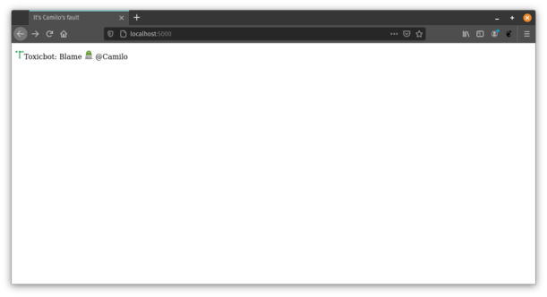

# blameCamilo
This endpoint blames Camilo.

requires flask

```
lcerezo@elchupin:~/src/git/blameCamilo$ export FLASK_APP=app/init.py 
lcerezo@elchupin:~/src/git/blameCamilo$ python3 -m flask run
 * Serving Flask app "app/init.py"
 * Environment: production
   WARNING: This is a development server. Do not use it in a production deployment.
   Use a production WSGI server instead.
 * Debug mode: off
 * Running on http://127.0.0.1:5000/ (Press CTRL+C to quit)


```

You can use a local browser to verify.  
